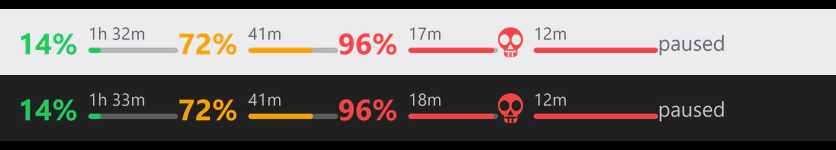

# LLM Usage Bar

Live usage of your LLM subscriptions on the Windows 11 taskbar - how much of your
limits you have used, and when they reset - drawn into the taskbar itself, always
visible, without opening anything.



It knows two providers so far, and is built so that more are one file each:

* **Claude** (Pro / Max) - the 5-hour session limit, the weekly limit and any
  model-specific weekly limit: the same numbers `claude /usage` shows, read with
  the sign-in Claude Code already keeps on the machine. Plus promotional events,
  like a free limit reset.
* **Ollama** (cloud models) - the plan's monthly credits, for running Claude Code
  or anything else on Ollama's cloud, read with the sign-in `ollama signin` keeps.

Pure Python (`ctypes` + Win32 + Pillow + tkinter). No extension, no injection;
each provider talks to that provider's own endpoint and nothing else leaves the
machine.

```
taskbar:  [ 35%  3h 50m ]           [start] [search]  ...   13.20
          [ ▰▰▰▱▱▱▱▱▱▱  ]
             ^ one provider: percentage, time to the reset, a bar

taskbar:  [ ✳ 35%  ▰▰▰▱▱  3h 50m ]
          [ ◉ 12%  ▰▱▱▱▱  18d 4h ]
             ^ two: a row each in the same width, Claude's spark and Ollama's ring
```

### How it behaves

* **The widget** sits in the taskbar's free left corner, where the weather widget
  used to be (turn Widgets off in Settings → Personalization → Taskbar to clear
  it). It is part of the taskbar's own window tree, so it is exactly as visible as
  the taskbar: hidden by a fullscreen video or Task View, untouched by Start,
  Search or clicking the taskbar.
* **Left click** - a Windows 11 style flyout with every limit, its reset time,
  a section per provider, and a link to each provider's usage page. It follows
  the Windows light/dark setting and closes when you click away.
* **Right click** - switch providers on and off (**Show Claude usage**, **Show
  Ollama usage**), refresh, edit or reload the config, open the log, quit.
* **Notifications** at 80%, 95% and when a limit runs out - once per limit per
  window, never a stream of repeats while you sit at the limit, held back while
  you are in a fullscreen app or a presentation.
* **A skull** instead of the number at 100%, drawn rather than an emoji so it
  stays crisp at any size.

Windows 11 has no way to put third-party content on the taskbar strip - the
weather readout belongs to Microsoft's widgets service, and the deskbands of
Windows 10 are gone. Everything you see living on the Windows 11 taskbar is a
window drawn over or into it, which is what this does (see `taskbar_widget`).
Tray icons next to the clock are there too, switched off by default.

## Install

Two ways, same app. A clone updates with one command; the exe needs nothing
installed on the machine.

The machine has to be signed in to whichever provider you want to see: Claude
Code for Claude (run `claude` once), `ollama signin` for Ollama. And the
taskbar's left corner has to be free: turn the Widgets button off in
**Settings → Personalization → Taskbar**.

### From a clone (recommended)

Needs Python 3 (`winget install Python.Python.3.12` if it is missing).

```powershell
git clone https://github.com/Aaresh1705/llm-usage-bar.git
cd llm-usage-bar
powershell -ExecutionPolicy Bypass -File install.ps1
```

That installs `pillow`/`requests` if they are missing, writes a `config.json`
with the defaults, registers a **scheduled task** that starts it ten seconds
after you sign in, and starts it now.

It is a task rather than a shortcut in the Startup folder for a reason. The
Startup folder is the last thing the shell gets to: measured on the machine this
was written on, the app launched **170 seconds after boot**, queued behind Teams,
OneDrive, Spotify and a Java updater - long enough that it looks like it never
started at all. The task does not wait in that queue, and it retries three times
if it fails. Use `-UseStartupFolder` if you would rather have the shortcut, and
the installer falls back to it by itself if your machine's policy forbids
registering tasks.

To update later:

```powershell
powershell -ExecutionPolicy Bypass -File install.ps1 -Update
```

which pulls and restarts. Your `config.json` is not tracked, so it survives
updates untouched.

### From the exe

Download `LLMUsageBar.exe` from the
[latest release](https://github.com/Aaresh1705/llm-usage-bar/releases/latest), or
build it with `build.ps1` (~19 MB, Python and all the libraries inside it). Put
it in a folder of its own and run it; `install.ps1` next to the exe makes it
start with Windows.

The exe keeps `config.json`, the log and the cache beside itself. If you put it
somewhere read-only, it uses `%LOCALAPPDATA%\llm-usage-bar` instead.

**Corporate PCs:** a self-built exe is unsigned, and a machine with Windows
Defender Application Control enforced will refuse to run it with "Access is
denied" no matter where you put it (check with
`(Get-CimInstance -Namespace root\Microsoft\Windows\DeviceGuard -ClassName Win32_DeviceGuard).CodeIntegrityPolicyEnforcementStatus`
— `2` means enforced). Use the clone route there: Python is signed, so it runs.

### Coming from Claude Usage Bar

This used to be *Claude Usage Bar* (`claude-usage-bar`). Nothing needs doing by
hand:

* `install.ps1 -Update` in an old clone keeps working - GitHub forwards the old
  address, and the app still starts through the old `claude_usage_bar.pyw`,
  which now just launches `llm_usage_bar.pyw`. Run `install.ps1` once more
  afterwards and the startup task moves over to the new name
  (*LLM Usage Bar*) and the old one is removed.
* On its first start the app renames its log (`claude_usage_bar.log` →
  `llm_usage_bar.log`) and its per-user folder. `config.json` and the caches keep
  their names, and your settings keep their meaning: the Claude-only ones that
  were at the top level (`refresh_seconds`, `check_events`, `usage_page_url`) are
  read as `providers.claude` settings.
* The old and the new version never run side by side, whichever starts first.

### Removing it

```powershell
powershell -ExecutionPolicy Bypass -File install.ps1 -Uninstall
```

Stops it and removes the scheduled task (and the Startup shortcut, if you used
one - the old name's too). `config.json` and the log stay.

## Providers

Right click the widget and tick **Show Claude usage** and/or **Show Ollama usage**
(the last one ticked stays on). The choice is saved in `config.json` under
`providers`. With one provider the widget shows it large; with several, a row
each in the same width, told apart by a small mark, and the flyout gets a
section per provider. Notifications are named after the provider ("Ollama
monthly limit reached"), and alerts from several providers that fall due on the
same poll share one toast.

### Claude

* **Where the numbers come from:** `https://api.anthropic.com/api/oauth/usage` -
  the endpoint Claude Code's own `/usage` reads, authenticated with the OAuth
  token in `~/.claude/.credentials.json`. It is not a documented public API, so
  the parser reads it defensively and falls back to the older `five_hour` /
  `seven_day` fields if the `limits` list ever disappears.
* **What it shows:** the 5-hour session limit, the weekly limit, every
  model-specific weekly limit, where this week's usage went (Claude Code, chats,
  Cowork, … as a split bar), any other usage pool once it is in use, and extra
  usage when that is enabled.
* **Sign-in:** if the token expires the widget keeps the last numbers; any
  `claude` command refreshes the credentials file and the next poll picks it up.
  Signed out for a quarter of an hour, you get one "not updating" nudge.

| Key | Meaning |
| --- | --- |
| `providers.claude.enabled` | Show Claude usage. Default `true`. |
| `providers.claude.refresh_seconds` | How often to poll while usage is changing. Default 120, which is also the minimum (see *Rate limits*). |
| `providers.claude.check_events` | Look for promotional grants once an hour (see *Events*). Default `true`. |
| `providers.claude.usage_page_url` | Where the flyout's usage-page link goes. |

#### Events

The usage endpoint also reports promotional **grants** - for example the one
from the Claude Opus 5.5 launch: *one usage-limit reset for Pro and Max, which
puts the 5-hour and weekly limits back to full*. While one is live the widget
shows a small amber sparkle in its corner, the flyout opens with a card saying
what it is, how many are left, what it clears and when it expires (with a button
to Settings > Usage, where you redeem it), and a toast announces it once.

* **The endpoint only tells Claude Code.** Asked by anything else it answers
  `"eligible": false, "ineligible_reason": "surface"`. So one poll an hour - the
  only request that does this - asks for grants (`?cedar_ember=1`) using the user
  agent of the Claude Code installed on this machine, read from
  `~/.local/share/claude/versions`. That poll carries the usual usage data too, so
  checking for events never costs an extra request. `check_events: false` turns
  it off.
* **Grants are read by shape, not by name.** Any program in the response that
  carries a `grants` list is picked up, so the next promotion appears without a
  code change. The app only displays grants; it never redeems one.
* **The event check can never hold up the numbers.** If that poll fails, is
  refused, or returns grants it cannot read, the usage is still used (or asked
  for again the plain way straight away), and the event check backs off on its
  own clock - 5 minutes, doubling to an hour. **Refresh** re-checks events too,
  so a reset you have just used stops being advertised at once.

`taskbar_widget.show_events` (default `true`) and `taskbar_widget.event_color`
(default `#F59E0B`) control the sparkle.

#### Rate limits

The Claude usage endpoint's rate limit is set on Anthropic's side, per account -
there is no way to raise it, and its 429s carry no hint of how long to wait
(`Retry-After: 0`). Measured from this app's own log, it sustains about **one
request per 100 seconds**: polling once a minute, every fourth or fifth request
was refused, around the clock. Claude Code on the same account draws on the same
allowance. So the app spends that allowance instead of running into it - and
every provider gets the same machinery, with its own numbers:

* **Never faster than every 2 minutes** (5 for Ollama), whatever the config says.
* **Slower while nothing changes.** Each poll that finds the numbers where they
  were waits half as long again, up to 5 minutes (15 for Ollama); the first
  change snaps back.
* **Nothing while the screen is locked**, and one poll soon after you unlock.
* **Learns from a 429.** Besides waiting it out (doubling up to 30 minutes), a
  refused timed poll slows the pace itself by a quarter, up to 15 minutes, fading
  by a tenth every six hours without another. So if something else on the
  account - Claude Code, a second PC - is using the allowance too, the app
  settles at the pace that is left.
* **Restarts cost nothing.** Pace, backoff and the time of the last request are
  kept in `.poll_state.json` (`.poll_state.ollama.json` for Ollama); a restart
  with fresh cached numbers waits until they are due.
* **Refresh** skips the wait, but pressed twice within 15 seconds it asks once,
  and a Refresh that hits the limit does not slow the pace.
* **A 429 is not an error** while the numbers are under 15 minutes old: the
  flyout just says when they are from.

A simulated day in the tests - an endpoint modelled on the log, with Claude Code
sharing it for eight working hours - goes from 1,154 requests with 286 refused
(polling every minute) to 374 requests with 2 refused, with the numbers never
more than 5 minutes old.

### Ollama

For Ollama's **cloud** models - used directly, or with Claude Code on top of
Ollama (`ollama launch claude`, or `ANTHROPIC_BASE_URL` pointed at Ollama).
Local models have no usage limit, so there is nothing to show for them.

* **Sign-in:** nothing to set up if `ollama signin` has been run on the PC - the
  app signs its request with the same key pair the `ollama` CLI uses
  (`~/.ollama/id_ed25519`), exactly the way the CLI does (Ed25519, implemented
  here from RFC 8032 rather than adding a crypto library). Alternatively create
  an API key at <https://ollama.com/settings/keys> and put it in
  `providers.ollama.api_key` (or the `OLLAMA_API_KEY` variable); a key wins over
  the sign-in when both are there.
* **What it shows:** the plan's **monthly credits**, as a percentage used - or, on
  subscriptions from before 31 Aug 2026, the 5-hour and weekly limits. Plus
  pay-as-you-go spend over the last four weeks when there is any.
* **Reset date:** Ollama renews the credits on the monthly anniversary of the
  subscription and does not report the date, so set `providers.ollama.reset_day`
  to that day of the month (1-31) for a countdown; without it the flyout says it
  renews on the billing day.
* **Where the numbers come from:** `GET https://ollama.com/api/usage`, the
  undocumented endpoint behind ollama.com's own usage page. It gives percentages
  only - no dollar amounts, no reset times - so that is what the app shows.

| Key | Meaning |
| --- | --- |
| `providers.ollama.enabled` | Show Ollama usage. Default `false`. |
| `providers.ollama.api_key` | Optional API key; empty means use `ollama signin`. |
| `providers.ollama.metric` | What the widget shows for Ollama: `monthly`, `session`, `weekly`, or `max` (the highest). Default `max`. |
| `providers.ollama.reset_day` | Day of the month the credits renew, for the countdown. |
| `providers.ollama.refresh_seconds` | Poll interval, at least 300. |

### Adding a provider

A provider is one module in `usagebar/providers/`: a subclass of
`usagebar.source.Source` that knows how to ask its endpoint.

```python
from datetime import datetime

from ..source import Source
from ..usage import Usage


class ExampleSource(Source):
    key, name = "example", "Example"      # config key, and the name people see
    poll_min, poll_idle, poll_max = 300, 900, 1800

    def fetch(self, events):
        u = Usage()
        ...                                # ask the endpoint; on trouble set u.error
        u.limits = [{"key": "monthly", "label": "Monthly", "percent": 42.0,
                     "resets_at": "2026-10-14T00:00:00+00:00"}]
        u.updated = datetime.now()
        return u
```

List it in `SOURCES` in `usagebar/providers/__init__.py` and give it a default
block under `providers` in `usagebar/config.py`. The menu entry, the widget row,
the flyout section, notifications, pacing, backoff, the cache and restarts all
come from the base class. Optional overrides: `usage_page()`, `metric()` (what
the widget shows), `limit_name()` (how notifications name a limit),
`signed_out_body()`, `reset_hint()` and `notes()` (extra flyout text), and a mark
for its widget row in `TaskbarWidget.MARKS`.

## Configuration

Everything lives in `config.json`. The file is watched: **save it and the widget
re-renders within two seconds**, no restart needed. Delete the file to regenerate
the defaults. Unknown keys are ignored; missing keys fall back to the defaults, so
you can keep a minimal file with just your overrides.

### Top level

| Key | Meaning |
| --- | --- |
| `providers` | Which usage to show, and each provider's own settings - see *Providers*. |
| `left_click` | `flyout`, `refresh`, or `web`. Applies to the tray icons and the widget. |
| `tray.enabled` | Draw the tray icons as well. Off by default; they show the first provider. |
| `primary_metric` | For Claude: what the big number (and the tray icon) shows - `session`, `weekly_all`, `weekly_scoped`, or `max` (whichever limit is highest). |
| `secondary_metric` | For Claude: what the tray icon's thin strip shows. Same values, or `null`. |
| `tooltip_template` | The tray tooltip for Claude - see placeholders below. |

### `taskbar_widget`

The widget is a **layered window that is a child of the taskbar** - created as a
popup and handed to `Shell_TrayWnd` with `SetParent` (Windows refuses to create
it as a child outright). That one decision does all the work: the widget is
exactly as visible as the taskbar, no more and no less. Whatever covers the
taskbar covers the widget - a fullscreen video, Task View - and whatever leaves
the taskbar alone leaves the widget alone: clicking the taskbar, opening Start, an
auto-hiding taskbar sliding away. None of that is detected in code; Windows does
it, because the widget is part of the taskbar's own window tree.

*Layered* (`UpdateLayeredWindow`, per-pixel alpha) means nothing paints a
background - the real taskbar, acrylic tint and all, shows through around the
glyphs, and each frame lands as one composited update, so nothing flickers.

The one thing a child inherits is its parent's fate: an Explorer restart destroys
the taskbar and its children with it. The widget notices within half a second
and rebuilds, backing off if the shell is not back yet.

| Key | Meaning |
| --- | --- |
| `enabled` | Master switch. |
| `metric` | Which Claude limit to show. `null` = whatever `primary_metric` is. (Ollama's is `providers.ollama.metric`.) |
| `corner` | `left` (where Widgets used to be) or `right` (before the tray). |
| `width` | Width in logical pixels at 100% DPI; scaled with the taskbar. Two providers share it. |
| `offset` | `[x, y]` nudge from the corner, also DPI-scaled. |
| `padding` | Gap above and below, so it doesn't touch the taskbar edges. |
| `background` | `transparent` (default) draws straight onto the taskbar. A hex colour paints a pill behind the content instead. |
| `background_alpha`, `corner_radius` | Only used when `background` is a colour. |
| `text_color` / `muted_color` | `auto` follows the Windows theme. |
| `show_bar`, `bar_height` | The progress bar. |
| `show_reset` | The time to the reset. Drop it to save width. |
| `show_events`, `event_color` | The sparkle for a live event. |
| `stale_opacity` | Opacity for numbers that have stopped being refreshed. Judged by age, not by whether the last poll failed. |
| `supersample` | Render scale for the text; 3 is plenty. |

Severity colours are the ones in `thresholds` (vivid green, amber and red by
default). At 100% the number is replaced by the drawn skull, inked in the
widget's own text colour so it follows the Windows theme.

**Limits worth knowing.** With the taskbar centred, the left corner is free until
you have a lot of windows open — Windows will happily slide app buttons under the
widget, since nothing reserves that space. Move it with `corner`/`offset` if that
bites. A vertical taskbar isn't supported (the widget hides itself). And because
this leans on the taskbar's shape, a Windows update that reworks the taskbar can
require a fix here — the tray icons are the fallback that can't break that way.

### `icon` (tray icons)

| Key | Meaning |
| --- | --- |
| `style` | `bar_text` (default: number over a fill pill), `text_bar` (number above a bar), `bar` (bar only), `ring` (donut + number), `text` (number only, colored). |
| `segments` | Makes the indicator **wider than one square** — see "Going wider" below. |
| `segment_mode` | `cells` (default) or `slice`. |
| `count` | Overrides the length of `segments` (pads with `bar`). `0`/absent = use `segments` as written. |
| `reverse_segments` | Flip left-to-right order if Windows registers your icons backwards. |
| `label_format` | Text in the number cell. `{pct}`, `{secondary}`, plus any literal text — e.g. `"{pct}%"`. |
| `skull_at` | Percentage at which the number is replaced by a drawn skull. Default `100`; `null` keeps the number (which can only show two digits, so 100% reads as `99`). |
| `skull_color` | Colour of that skull. Default `"auto"`: near-black under the light Windows theme, near-white under the dark one. Give a hex colour to pin it. |
| `text_cell_style` | Style used for a `text` segment: `text` (default), `bar_text`, `ring`. |
| `cell_bar_thickness` | Bar height inside a `bar` segment, as a fraction of the icon. |
| `use_guid` | Stable per-segment identity so Windows remembers tray promotion. Default on. |
| `orientation` | `horizontal` or `vertical` — only affects `bar`. |
| `margin` | Pixels of transparent padding at the icon edge. |
| `corner_radius` | Pill/bar rounding in pixels. |
| `track_color` / `track_alpha` | The unfilled part of the bar. |
| `text_color`, `text_shadow` | The number. |
| `font_file` | Any file in `C:\Windows\Fonts` — `segoeuib.ttf`, `seguisb.ttf`, `consolab.ttf`, … |
| `font_scale` | Number height as a fraction of the available box. |
| `bar_thickness`, `secondary_thickness`, `gap` | Fractions of the icon size. |
| `show_secondary`, `secondary_color` | The thin second-metric strip. |
| `ring_thickness` | Donut width for `style: ring`. |
| `supersample` | Anti-aliasing factor (8 = render at 8× then downscale). |

#### Going wider than a square

A single tray icon is fixed square by Windows (`SM_CXSMICON`: 16px at 100% DPI,
24px at 150%) — there is no API to request a wider slot. The way around it is to
register **several tray icons** and treat them as one indicator. `segments` is the
list of what each icon draws, left to right:

```json
"icon": {"segments": ["text", "bar", "bar", "bar"], "reverse_segments": true}
```

gives `92 ▬ ▬ ▬` — the number, then a three-cell gauge where each cell owns 33% of
the range and fills in turn, like signal strength. Roles:

| Role | Draws |
| --- | --- |
| `text` | The percentage (styled by `text_cell_style`). |
| `bar` | One cell of the primary gauge; cells split the 0-100 range evenly. |
| `secondary` | A full bar of the secondary metric in `secondary_color`. |
| `ring` | A donut for the primary metric. |
| `blank` | Transparent spacer. |

Up to 8 segments. Windows 11 pads between tray cells, so segments read as a
**dashed** gauge - that is why `cells` is the default. `"segment_mode": "slice"`
renders one continuous bar and cuts it into pieces instead, with visible notches.
Windows may register the icons right-to-left (`"reverse_segments": true` fixes
the order), and **Windows 11 hides new tray icons by default** - re-run
`install.ps1`, drag them out of the `^` overflow, or use Settings ->
Personalization -> Taskbar -> Other system tray icons.

### `thresholds`

A list of `{at, color}` — the fill colour for a limit, applied at or above each
percentage. Add as many stops as you like:

```json
"thresholds": [
  {"at": 0,  "color": "#3FB950"},
  {"at": 50, "color": "#9BD65C"},
  {"at": 75, "color": "#D29922"},
  {"at": 90, "color": "#F85149"}
]
```

### `tooltip_template`

`\n` for line breaks (tray tooltips cap at 127 characters). Placeholders:

`{primary}` `{primary_label}` `{primary_reset_short}` `{primary_reset_in}`
`{secondary}` `{secondary_label}` `{secondary_reset_short}` `{secondary_reset_in}`
`{updated}`

Other providers get a line each below it.

### `notifications`

```json
{"enabled": true, "at": [80, 95, 100],
 "metrics": ["session", "weekly_all", "weekly_scoped"],
 "events": true, "signed_out_after": 900}
```

| Key | Meaning |
| --- | --- |
| `at` | Percentages to warn at. Reaching 100% is always announced ("Session (5h) limit reached"), whether or not it is listed. |
| `metrics` | Which Claude limits to watch: `session`, `weekly_all`, `weekly_scoped` (every model-specific weekly limit, each on its own), or `max` (whichever is highest). Other providers' limits are all watched. |
| `events` | Announce a live promotion (see *Events*) once, when it can be used. |
| `signed_out_after` | Seconds of refused sign-in (or no sign-in on this PC at all) before one "… usage is not updating" nudge. |

The rules, all covered by the tests:

* **Once per threshold per limit window.** Never twice for the same level, never
  again for a level already passed, not again when usage dips below and back.
* **A limit reset re-arms them.** Inside one window usage only falls to under half
  the lowest threshold when the limit was reset early - a redeemed limit reset -
  so running out again after that is announced again.
* **A window is its reset time, rounded to the minute.** The Claude API reports
  the same reset instant with different microseconds on every request
  (`12:10:00.165535`, then `12:10:00.134418`). Comparing the raw strings made
  every poll look like a new window, so an hour at 100% produced 60
  notifications. Rounded, it produces one.
* **Remembered across restarts** in `.notify_state.json`, so rebooting at 100%
  does not announce it again.
* **Everything due on one poll shares a toast** - several limits, several
  providers, or a limit and a new event - instead of one replacing the other.
* **Held back, not dropped.** While Windows says you are busy (a game, a
  fullscreen video, a presentation) nothing is shown - and nothing is marked as
  shown, so it appears once you are back.
* Errors and rate limiting never trigger anything, however they flap. The one
  exception is sign-in: refused for `signed_out_after` seconds, you get a single
  nudge per outage - and going offline in the middle of it does not start a new
  one.

### `flyout`

| Key | Meaning |
| --- | --- |
| `width` | Panel width in logical pixels; scaled for DPI. |
| `theme` | `auto` follows the Windows app theme, or force `light` / `dark`. |
| `accent` | `auto` uses your Windows accent colour for the primary button, or a hex colour. |
| `corner_offset` | `[x, y]` distance from the work-area corner. |
| `close_on_focus_loss` | Close when you click elsewhere, like a system flyout. |

Colours inside the panel come from the Windows 11 Fluent palette rather than
`config.json`, so the panel matches the OS in either theme. The severity colours
still track the `thresholds` you configure.

## Recipes

**Claude and Ollama side by side**
```json
{"providers": {"claude": {"enabled": true}, "ollama": {"enabled": true, "reset_day": 14}}}
```

**Only Ollama, polled every 10 minutes**
```json
{"providers": {"claude": {"enabled": false},
               "ollama": {"enabled": true, "refresh_seconds": 600}}}
```

**Track Claude's weekly limit instead, red early**
```json
{"primary_metric": "weekly_all",
 "thresholds": [{"at": 0, "color": "#3FB950"}, {"at": 40, "color": "#F85149"}]}
```

**Whatever is closest to the limit**
```json
{"primary_metric": "max", "providers": {"ollama": {"metric": "max"}}}
```

## Notes

* Only one instance runs: a per-session named mutex, which a second copy waits
  on briefly before giving up - so a leftover lock can't stop the app from
  starting again, and the version from before the rename can't run beside it.
* Every launch writes a `starting v2.0.1 (pid …)` line to `llm_usage_bar.log`, so
  "it didn't come back after a reboot" is answerable. A line means it started -
  compare its timestamp with `(Get-CimInstance Win32_OperatingSystem).LastBootUpTime`
  to see how long the shell took to get to it. No line at all means Windows never
  launched it: check `Get-ScheduledTask 'LLM Usage Bar'`.
* Errors go to the log (right click → Open log): every launch, every widget
  hide/show with its reason, every failing timer. A fatal error inside Python or
  Tcl - which would otherwise vanish, since `pythonw` has no console - is written
  with every thread's stack to `llm_usage_bar.crash.log`.
* Every timer chain is individually guarded: a Tk `after` callback that raises
  kills its chain silently, so one unguarded exception used to be enough to stop
  polling or clicks while the app kept running and looking healthy.
* Window procedures never call into Tk; clicks and menu choices are queued and run
  by the app's own loop. Windows calls window procedures from whichever loop
  dispatches the message - often Tk's own - and calling back into Tk from there
  aborts the process.
* Dependencies are imported with a retry loop for the first minute — at logon the
  profile or site-packages can briefly be unavailable.
* Network blips show `offline` without wiping the displayed numbers, and the last
  good figures are cached per provider (`.usage_cache.json`,
  `.usage_cache.ollama.json`), so a restart shows numbers immediately. The cache
  is ignored once it is more than 12 hours old, and numbers are dimmed once they
  are older than ten minutes or two polls.

## Files

| File | |
| --- | --- |
| `llm_usage_bar.pyw` | Starts the app - what the startup task runs. |
| `usagebar/` | The app. `app.py` (the main loop, menu, notifications), `source.py` (the provider base class: pacing, backoff, cache), `providers/` (one module per provider), `widget.py`, `flyout.py`, `toast.py`, `render.py`, `config.py` (the defaults), `usage.py`, `paths.py`, `win32.py`, `tkui.py`, `util.py`, `deps.py`. |
| `claude_usage_bar.pyw` | The old name, kept so installs from before the rename keep starting. |
| `config.json` | Your settings, hot-reloaded. Not tracked by git: it is written from the defaults on first run, so it survives updates. |
| `install.ps1` | Install, update (`-Update`), uninstall (`-Uninstall`). Registers the logon task; `-UseStartupFolder` for a shortcut instead. |
| `build.ps1` | Builds the standalone `dist\LLMUsageBar.exe`. |
| `make_icon.py` | Draws `assets\LLMUsageBar.ico` for the exe and the shortcut. |
| `make_preview.py` | Redraws `preview.png` with the widget's own renderer, so the picture cannot drift from the app. |
| `tests/test_usage_bar.py` | Notifications, events, pacing, providers and the move from the old name, driven through the real code: `python tests/test_usage_bar.py`. It writes only into a temporary folder. |
| `LICENSE` | MIT. |

## Licence

MIT - see [LICENSE](LICENSE).
